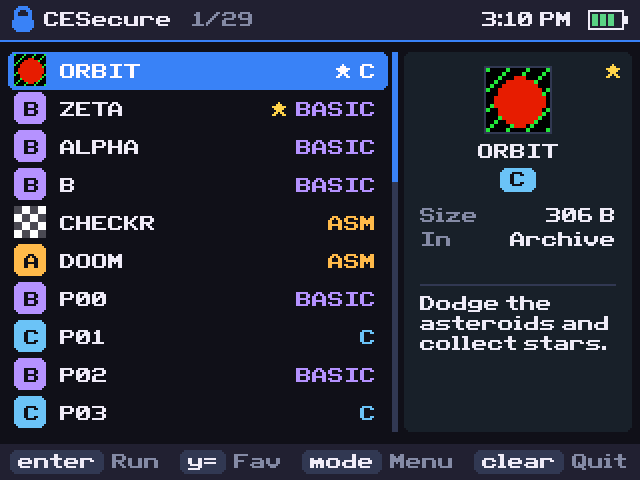
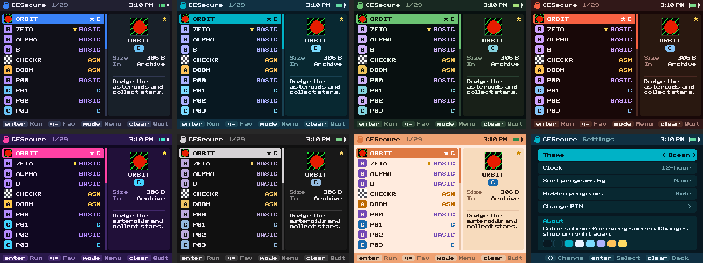

# CESecure

A PIN-locked program launcher for the TI-84 Plus CE, in the spirit of Cesium
and CEaShell. On start it asks for a 4–8 digit PIN, then shows your programs
with their icons and descriptions, ready to run with one key.

> **This is a casual lock, not real security.** See [Limitations](#limitations).



## Features

- **Program icons and descriptions.** Reads the same icon and description data
  that Cesium and CEaShell show for C, ICE and assembly programs. Programs
  without an icon get a colored badge for their type.
- **Info panel.** Type (C, ICE, ASM, BASIC), size, archive or RAM, and whether
  a program is locked or hidden.
- **Favorites.** Press `y=` to pin a program to the top of the list (up to 16).
- **Letter jump.** Press any key with a green letter above it to jump to the
  next program starting with that letter, like in Cesium.
- **7 color themes:** Midnight, Ocean, Forest, Ember, Synthwave, Graphite, and
  Seashell (a light theme inspired by CEaShell).
- **Settings:** theme, 12- or 24-hour clock, sort by name, type or size, show
  hidden programs, and change PIN.
- **Status bar** with the time and battery level.
- **30-second lockout** after three wrong PINs.



## Install

1. **Jailbreak the calculator.** On newer OS versions, assembly and C programs
   won't run without a jailbreak. Set up **arTIfiCE** (and **AsmHook2**, if you
   use it) by following their own instructions.
2. **Install the CE C libraries.** Download `clibs.8xg` from the
   [CE libraries releases](https://tiny.cc/clibs) and send it to the calculator.
   CESecure needs `graphx` and `fileioc` from this pack.
3. **Send CESecure.** Open **TI Connect CE**, connect the calculator by USB, and
   drag `bin/CESECURE.8xp` (and `clibs.8xg`, if you haven't sent it yet) into
   the calculator explorer. You can also use *Actions → Send to Calculators*.
4. **Run `CESECURE`** the same way you normally launch assembly programs on
   your setup (from arTIfiCE, a shell, or the home screen with AsmHook2).

The first time it runs, CESecure asks you to pick a PIN and type it twice. After
that, every launch asks for the PIN.

## Controls

**PIN screen**

| Key       | Action                      |
|-----------|-----------------------------|
| `0`–`9`   | Enter a digit (max 8)       |
| `del`     | Erase the last digit        |
| `enter`   | Submit (needs 4+ digits)    |
| `clear`   | Quit (or go back, when changing the PIN) |

Three wrong PINs in a row lock the screen for 30 seconds.

**Program list**

| Key                 | Action                                      |
|---------------------|---------------------------------------------|
| `up` / `down`       | Move the cursor (wraps around)              |
| `left` / `right`    | Page up / page down                         |
| `enter` / `2nd`     | Run the highlighted program                 |
| `y=`                | Add or remove a favorite                    |
| green letter keys   | Jump to the next program with that letter   |
| `mode`              | Settings                                    |
| `clear`             | Quit                                        |

When a program finishes, you land back in the list with the cursor on it. You
aren't asked for the PIN again, because you already unlocked this session.

**Settings** (`mode`)

| Key                 | Action                                      |
|---------------------|---------------------------------------------|
| `up` / `down`       | Choose a setting                            |
| `left` / `right`    | Change it                                   |
| `enter` / `2nd`     | Change it, or open **Change PIN**           |
| `clear` / `mode`    | Back to the list (saves your changes)       |

**Change PIN** asks for your current PIN first.

## How the PIN is stored

The PIN itself is never saved. CESecure stores a 16-byte record in an AppVar
named `CESecPW`:

- the magic string `CSP1`
- an 8-byte random salt
- a 32-bit hash: FNV-1a over the salt and PIN, repeated 2000 times

The AppVar is archived so it survives a RAM clear. If the archive is full, it
stays in RAM and CESecure tells you so.

Settings and favorites live in a separate archived AppVar, `CESecCfg`. It is
only written when you change something. Deleting it just resets the settings.

## Limitations

CESecure only controls what happens **inside CESecure**. It does not lock the
calculator. In particular:

- **Programs can still be run from the `prgm` menu** or any other shell,
  without the PIN.
- **Deleting the `CESecPW` AppVar removes the PIN** (`2nd` `mem` → Mem
  Management → AppVars). The next launch treats it as a first run.
- **Resetting the calculator** (archive or full reset) also removes it.
- The 32-bit hash with a 4–8 digit PIN can be brute-forced quickly on a
  computer if someone copies the AppVar off the calculator.
- Quitting and restarting CESecure resets the wrong-PIN counter.

Use it to keep casual users out of your program list, not to protect anything
that matters.

## Building from source

You need the [CE C toolchain (CEdev)](https://github.com/CE-Programming/toolchain)
with `CEdev/bin` on your `PATH`.

```sh
make            # builds bin/CESECURE.8xp
make clean
```

The linker prints notes about a missing `.note.GNU-stack` section. Those are
expected and harmless.

To regenerate the 16×16 padlock icon (needs Pillow):

```sh
python3 tools/make_icon.py
```

### Layout

```
makefile           CEdev build settings
icon.png           16x16 program icon (generated by tools/make_icon.py)
src/main.c         entry point: first-run setup or unlock, then the launcher
src/pin.c/.h       PIN entry, hashing, lockout, change PIN
src/launcher.c/.h  program list, icons, info panel, favorites, running programs
src/settings.c/.h  settings menu
src/config.c/.h    settings and favorites (CESecCfg AppVar)
src/storage.c/.h   AppVar write + archive helper
src/ui.c/.h        graphx setup, themes, status bar, key chips, messages
tools/make_icon.py icon generator
screenshots/       images used in this README
```
